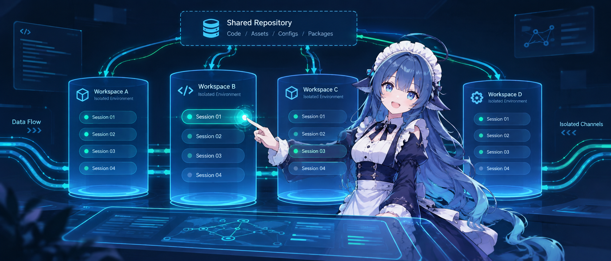
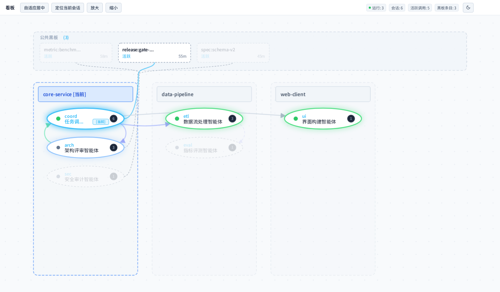

<p align="center">
  
</p>

<h1 align="center">dsh-call-session</h1>

<p align="center">
  DeepSeek Harness (DSH) 进程内跨会话通信管道与工作区共享黑板
</p>

<p align="center">
  <a href="https://github.com/popu2do/dsh-call-session/blob/master/LICENSE"></a>
  <a href="./docs/adrs/README.md"></a>
  <a href="https://nodejs.org"></a>
  <a href="https://cordis.moe"></a>
  <a href="https://www.typescriptlang.org/"></a>
</p>

<p align="center">
  <a href="README.md">English</a> | 简体中文
</p>

---

## 概述

DeepSeek Harness 原生会话之间相互隔离，子任务也是用完即销毁。

`dsh-call-session` 为 DSH 提供进程内跨会话通信、同级会话创建与共享黑板能力：
- 会话间单播：独立长效会话之间互相发送指令或交接任务。
- 公共黑板：大文本产物发布到黑板，其他会话按需拉取，不污染上下文。
- 协作看板：DSH Web 中提供全局只读看板，查看会话状态与调用连线。

---

## 安装

```bash
# 安装到指定 profile web
dsh plugin --profile web add dsh-call-session

# 查看已安装插件
dsh plugin --profile web list

# 卸载插件
dsh plugin --profile web remove dsh-call-session
```

> 注意：`--profile` 参数必须置于 `plugin` 子命令之后，如 `dsh plugin --profile web ...`。

---

## 场景

用户直接在对话框中用自然语言向智能体下达指令，智能体自动调用底层工具完成协作：

#### 任务交接

用户输入：
> 把本次任务 handoff 总结 call 给 "audit-session" 会话，交接任务。

当前会话自动调用 `session_call` 向目标会话发起单播。目标会话处于运行态时直接引导，处于空闲态时唤醒新一轮对话。

#### 结论公布

用户输入：
> ok 将本次评审的结论公布，提醒其他合适的 session 角色去领取任务。

当前会话调用 `board_post` 将详细评审报告写入公共黑板，取得 `postId`。其他会话按需通过 `board_list` 查阅，避免几十 KB 的大文本在会话间来回复制导致上下文爆炸。

#### 会话创建

用户输入：
> 创建会话，交接任务。

当前会话调用 `session_create` 直接在当前工作区拉起长期运行的同级会话，并自动继承当前模型规格与预设。

---

## 看板

在 DSH Web 会话视图顶部提供看板，用于实时观察工作区内的多会话协作全景：

<p align="center">
  
</p>

- 拓扑呈现：展示工作区分组列、运行与就绪状态节点、黑板条目及存活倒计时、调用连线轨迹。
- 交互观测：悬停高亮 1-Hop 关联链路，双击节点展开只读详情抽屉。
- 只读边界：看板为纯只读视图，不提供修改、删除或触发调度的控制入口，全部状态变更由智能体自身产生。

---

## 工具

| 工具 | 类型 | 机制 | 常见场景 |
| :--- | :--- | :--- | :--- |
| `session_call` | Tool | 推送 | 1:1 单播呼叫，用于任务派发、进度汇报与交接通知 |
| `session_create` | Tool | 原生 | 创建长期运行的同级会话，用于分工派生与多角色协作 |
| `session_query` | Tool | 只读 | 检索会话列表，查看当前工作区或跨工作区会话状态 |
| `board_post` | Tool | 拉取 | 发布黑板条目，用于公布大文本产物与共享状态 |
| `board_list` | Tool | 拉取 | 检索黑板记录，按需点查详情或浏览标题摘要 |
| `board_clear` | Tool | 管理 | 归档或删除条目，用于清理失效或已完成的黑板记录 |

---

## 对比

| 方案 | 机制类型 | 协作模型 | 适用场景 |
| :--- | :--- | :--- | :--- |
| `subagent` | 原生内置 | 纵向父子委托，单任务派生，完成后回收 | 局部探索、代码检索、单次脚本运行等封闭任务。 |
| `dsh-call-session` | 扩展插件 | 横向对等协作，进程内跨会话单播与共享黑板 | 多个独立长效会话间的指令派发、状态同步，或共享大体量中间产物。 |

选型原则：
- 优先原生：单一独立封闭任务直接使用 DSH 内置的 `subagent`。
- 按需选用：当存在多个并行运行的独立顶层会话且需要相互协作或借由黑板共享上下文时，选用 `dsh-call-session`。

---

## 配置

插件支持开箱即用。如需自定义落盘防抖延迟或黑板容量上限，可在 `~/.dsh/profiles/web/cordis.patch.yml` 中配置：

```yaml
- id: dsh-call-session
  config:
    debounceMs: 500
    maxCapacity: 500
```

配置项：
- `enabled`：是否启用插件，默认 `true`。
- `debounceMs`：黑板落盘防抖延迟毫秒数，默认 `300`。
- `maxCapacity`：黑板条目容量硬上限，默认 `200`。
- `telemetryCapacity`：看板调用轨迹保留条数上限，默认 `200`。

---

## 架构

系统的架构演化与技术决策完整记录于架构决策记录（ADR）：

- 决策索引参见 [docs/adrs/README.md](./docs/adrs/README.md)。
- 离线架构拓扑与交互式全景参见 [docs/architecture/](./docs/architecture/)。

---

## 兼容

| 环境 | 版本范围 | 实测验证 |
| :--- | :--- | :--- |
| DeepSeek Harness | `>=0.1.1-rc.1` | `0.1.2-rc.1`、`0.1.5-rc.1`、`0.1.5-rc.2` |
| Cordis | `^4.0.2` | `4.0.2+` |
| Node.js | `>=20.0.0` | `20.x`、`22.x` |

---

## 许可

本项目基于 [MIT 许可证](./LICENSE) 开源。